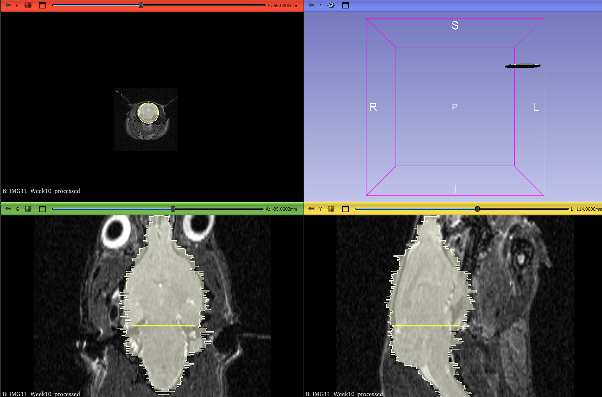
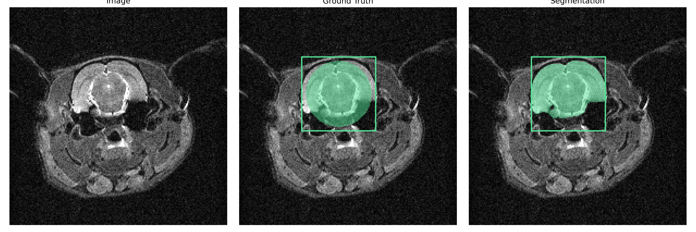
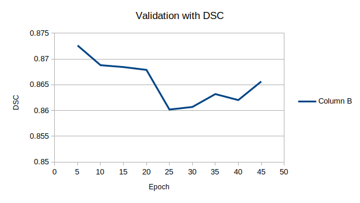
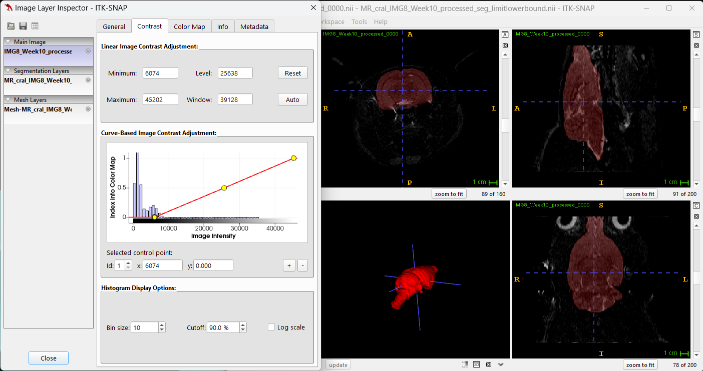

## Workstream with litSAM

### Prepare reckless segmentation .rrd file with 3D slice


### Transform .rrd file to .nii
```
./addon/nrrd_2_nii.py
```

### Transform .nii of Image and reckless segmentaion into .npz
```
sh preprocessdata.sh
```

### Predict
```
sh inference.sh
```

### Tranform the image and final segmentation into .nii
```
./addon/npzConverter.py
```
> transform image because the *nib.Nifti1Image* will change the orientation, will be fixed


### Result

>
> MR_cral_IMG8_Week10_processed.npz dsc value: 0.862131
> MR_cral_IMG8_Week10_processed.npz,dsc value: 0.8643 (two more training cases)
> MR_cral_IMG8_Week10_processed.npz,dsc value: 0.875 (earlystop)
> MR_cral_IMG8_Week10_processed.npz,dsc value: 0.863877 (dedicated mask)
> MR_cral_IMG8_Week10_processed.npz dsc value: 0.969804 (limit lower boundary to 6000)
>
### Validation



### LimitLowerBoundary


